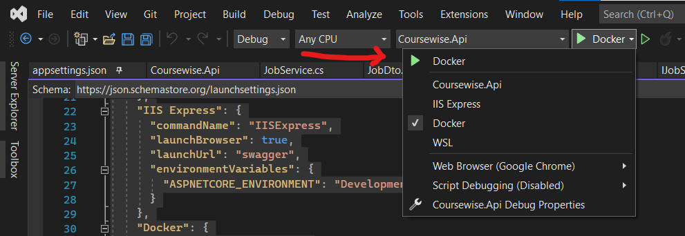
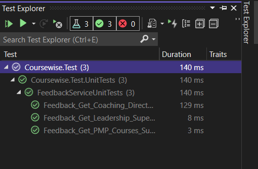
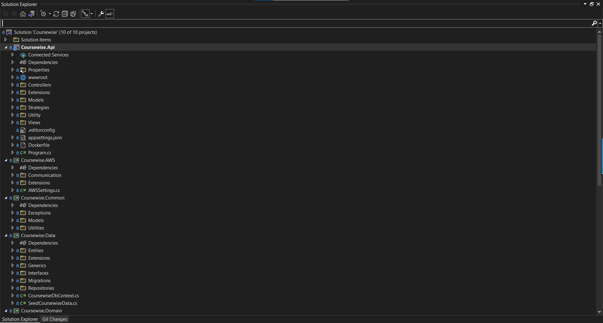
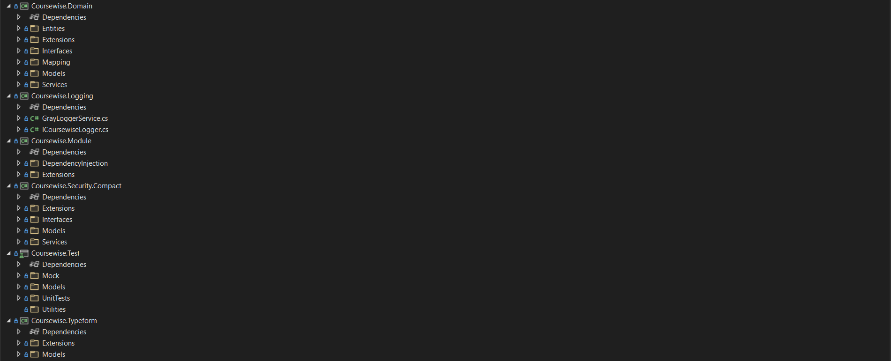

# Boardwise API #

### Product Overview ###
Boardwise is a platform for non-executive directors find board opportunities to advance their career.

### Component Overview ###
- API
    - Controllers
    - Extension and utilities
    - Models
- Data
    - Communicate with the database
    - Contain repositories, migrations, seed initial data seeding
- Common
    - Common utilities
    - Common models
- Module
    - Dependency injection management (Component, Service and Repository modules)
- Security.Compact
    - Use Microsoft identity to manage user management
    - JWT token generation service 
- Domain
    - This is the main component, all central business logic in this component, api/windows service mostly communicate to data layer using this component.
    - You will find strategy and facade patterns as well for some services and their logic.
    - Models(Domain/Data) mappings
- Logging
    - Graylog logger to log information, warnings, errors, exceptions
- Test
    - Mocks services
    - Unit test for controllers and services
- ExternalLogin
    - Linked in and Google external login
- AWS
    - Artifact management using S3
    - Email Service

### Third-Party Integrations ###
- Stripe
Customer can buy courses for this purpose stripe payment gateway is used.
- Google OAuth
Used for external sign in and registration with Google.
- LinkedIn OAuth
Used for external sign in and registration with LinkedIn.
### Installation & Run ###
- Make sure you have installed [.NET 6](https://dotnet.microsoft.com/en-us/download/dotnet/6.0)
- Make sure you have installed [5.7.x MySQL Community Server (GPL)](https://dev.mysql.com/downloads/mysql/5.7.html)
- Production and Staging AWS RDS Aurora(MySQL 5.7) 2.10.2
- Make sure you have any MySQL client like MySQL Workbench or Navicat etc.
- Make sure you have Visual Studio.
- Optional, we are running API in container so its good if you can install docker.
- If you are running the API first time, then first you need to create a database and make sure to add database name, the MySQL server username, and password in **appsettings.json**
- Some secrets are not avilable in **appsettings.json**, you can contact your lead to get these secrets or get it from [s3 transformation butcket](https://s3.console.aws.amazon.com/s3/buckets/coursewise-transformation?region=eu-west-2&tab=objects) file name is appsecrets.json.
- On the first time, It will seed the data of the following tables (Courses, Categories, Levels, Admin account).
- launchSettings.json looks like this
```{
  "$schema": "https://json.schemastore.org/launchsettings.json",
  "iisSettings": {
    "windowsAuthentication": false,
    "anonymousAuthentication": true,
    "iisExpress": {
      "applicationUrl": "http://localhost:32929",
      "sslPort": 44348
    }
  },
  "profiles": {
    "Coursewise.Api": {
      "commandName": "Project",
      "launchBrowser": true,
      "launchUrl": "swagger",
      "environmentVariables": {
        "ASPNETCORE_ENVIRONMENT": "Development"
      },
      "applicationUrl": "https://localhost:7148;http://localhost:5148",
      "dotnetRunMessages": true
    },
    "IIS Express": {
      "commandName": "IISExpress",
      "launchBrowser": true,
      "launchUrl": "swagger",
      "environmentVariables": {
        "ASPNETCORE_ENVIRONMENT": "Development"
      }
    },
    "Docker": {
      "commandName": "Docker",
      "launchBrowser": true,
      "launchUrl": "{Scheme}://{ServiceHost}:{ServicePort}/swagger",
      "environmentVariables": {
        "ASPNETCORE_URLS": "https://+:443;http://+:80",
        "ASPNETCORE_HTTPS_PORT": "49155"
      },
      "httpPort": 49154,
      "useSSL": true,
      "sslPort": 49155
    }
  }
}
```
- Run API



- In the development mode you can access swagger api documentation, but we will recommend you will use postman collection and enviroment to intereact with the API, you can contact your lead to get these files or get it from [s3 transformation butcket](https://s3.console.aws.amazon.com/s3/buckets/coursewise-transformation?region=eu-west-2&tab=objects) file names are "Boardwise-Coursewise.postman_collection.json", "Boardwise-Coursewise Local.postman_environment.json"

### Running Tests ###
- Install newman for api testing of postman collection.
```
npm install -g newman
```
- Run postman automated test collection, you can get key from bitwarden.
```
- newman run https://api.getpostman.com/collections/20056291-5ea026e9-acd2-4841-950d-41fc3cdf4f54?apikey=$POSTMAN_KEY -e https://api.getpostman.com/environments/20056291-b3702dc3-88d5-403d-9944-3d71d16be3b1?apikey=$POSTMAN_KEY
```
- You can run unit test from test explorer in visual studio.


- These both tests are also configured in build pipeline.
### Code Structure ###



### Team Environments ###
- Development
    - Front end devs use this enviroment to develop new features on their local machine.
- Staging
    - This is used by QA, PM, Designer & Founder.
- Production
    - Customers use this env.
### Release Pipeline ###
We are using **Bitbucket** for build and deployment.
When we commit code in master branch, It trigger the build process and deployment process, we are using main branching strategy where we have only one branch i-e master it deploys to development environment when code is merged to master branch, for staging and production we have to manually trigger the deployment, following steps will run:

- Sonarcloud Analysis on Web App
- Sonarcloud Analysis on API
- API Unit Testing (Only on master branch)
- Build and push API project
- Build and push Web App project
- Initialize dev environment
- Deploy API to dev environment
- Deploy Web App to dev environment
- End to end testing using Cypress
- Initialize staging environment (Triggered manually)
- Deploy API to staging environment
- Deploy Web App to staging environment
- Initialize production environment (Triggered manually)
- Deploy API to production environment
- Deploy Web App to production environment
